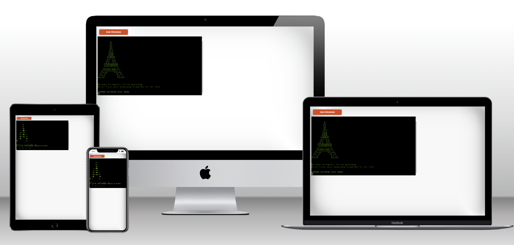
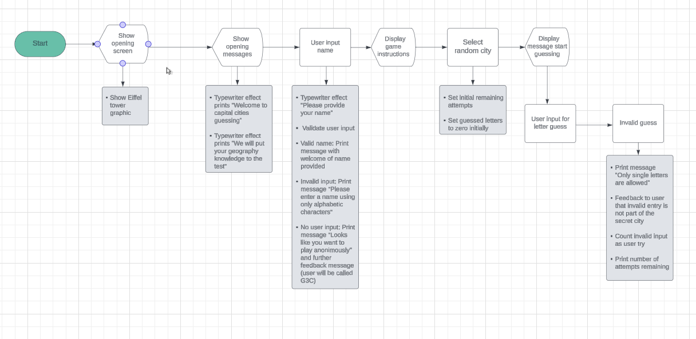

# Capital City - CodeInstitute Python Essentials Project

Capital City is a hangman game to guess the capital cities of different countries.
The user enters one character at a time to guess a randomly picked capital city. 
The website is built with Python.

The live site can found here: **[Link to Repository](https://project3test-72b134b84518.herokuapp.com/)**

The GH repository can be found here: **[Link to Repository](https://github.com/Werner-Staeblein/Project-3)**

# Table of contents

- **[Intro](#intro)**
- **[Design](#design)**
- **[Features](#features)**
- **[Technologies](#technologies)**
- **[Testing](#testing)**
- **[Technologies](#technologies)**
  
# Intro

## User Stories

Capital City is for users who want to test their knowledge about the capital cities of various countries worldwide.

A user of the application wants to

- easily start and view the instructions for the game
- understand easily the purpose of the application
- have clear instructions what to do and how to use the application
- have instructions and guidance while playing the game
- be presented different questions (a different capital city guess) when playing the game
- wants to play the game again once a guessing round is completed

**Placeholder for site administrator experience**

- requirement to validate user input

# Design

The design of the game is limited. The user interface is text-based based on the command-line application developed with Python. Since the game is terminal-based, no images such as .jpg or other image formats can be used.

The logo of Capital City, represented by the Eiffel Tower, is displayed using ASCII
art. The stages of the game are displayed with multiline strings.

## Flowchart                                       
    								        
A flowchart was prepared in the planning phase and developed alongside the coding of the command-line application. The flowchart was created with **[Lucidchart](https://www.lucidchart.com/pages/)**

 Click here for the flowchart 

 									

										
                                            
# Features

Feature 1: Welcome message | Logo
The logo for the application was created with an ASCII Art Generator

**Placeholder for logo screenshot**

Feature 2: Ask for player name
User either enters player name or not. Input is validated. No user input results in name assigned to user.

**Placeholder for user name feature**

# Technologies

**[Visual Studio Code](https://code.visualstudio.com/)** Visual Studio Code (VS-Code) was used as integrated development environment for the entire project. The GitHub repository was cloned to VS-Code for this purpose

**[GitHub](https://github.com/)** The code files, README files and assets are stored on GitHub. The code on GitHub was pushed from Git

**[Git](https://git-scm.com/)** The version control system Git was used to document the development of the application and to push code to the GitHub repository. The specific reasons for the commit are reflected in the respective commit message
            
**[Heroku](https://www.heroku.com/)** Heroku is a platform as a service (PaaS) to build, run, and operate applications cloud-based. It was used to deploy the website

**[Lucid Chart](https://www.lucidchart.com/pages/)** Lucid Chart is a web-based diagramming tool to create flowcharts, wireframes, and visualisations of concepts

**[CI Python Linter](https://pep8ci.herokuapp.com/)** The Code Institute Python Linter was used to validate Python code

**[Python](https://www.python.org/)** Python is an interpreted, high-level and general purpose programming language

**[ASCII Art Generator](https://emojicombos.com/eiffel-tower-ascii-art)** ASCII art generator for image of Eiffel tower
       
**[Techsini](https://techsini.com/multi-mockup/)** Multi Device Website Mockup generator 

### Libraries and python built-in modules used

**[sys](https://docs.python.org/3/library/sys.html)** sys was used for system-specific functions such as exit()

**[Random Module](https://docs.python.org/3/library/random.html)** The random module was used to pick a random capital city from a list of cities

**[Colorama](https://pypi.org/project/colorama/)** Installed with pip install colorama. Used to change colors of UI

**[Time](https://docs.python.org/3/library/time.html)** time was used to create typewriter effects

**[os](https://docs.python.org/3/library/os.html)** os module was imported to allow for screen to be cleared a game round if user chooses to play another round of the game

# Testing

1. Validator Testing	
    
    **[CI Python Linter](https://pep8ci.herokuapp.com/)** The Code Institute Python Linter was used to validate python code and conformity to PEP8 style guide
    
    Some warnings on code lines slightly too long resulting from the use of variable names that might be slightly too long. Variable names are, however, more explanatory (conflict of variable name being self-explanatory versus maximum line length)

    Python Linter warns "expected 2 blank lines after class or function". At the same time, requirements for project 3 are: "there are no unnecessary repeated blank lines". So, when TWO lines are added after a function, the linter does NOT report warning. However, when TWO lines are added, the assessment requirements for the project would be violated. I decided to accept the warning of the Python Linter and satisfy the specifications laid out in the assessment guide for project 3.
    
**Placeholder final python linter**
    
    
2. Validator Testing	
    
    **[Lighthouse](https://developer.chrome.com/docs/devtools/overview?hl=de)** 
    
    Lighthouse was used to check the website performance, accessibility, best practices, and SEO. Except for SEO, the score for desktop are satisfactory.

    
3. Manual Testing	
    
| Test            | Test Description | Expected Outcome | Result |					
|-----------------|------------------|------------------|--------|					
|                 |                  |                  |        |					
|                 |                  |                  |        |					
|                 |                  |                  |        |					

## Issues not resolved in testing

I tested the application on various screen sizes. As it turned out, the font size and length of command-line text generated would have to be either increased or length limited in size. I was not able to find an approach to make the application responsive with something similar to media-queries.

# Deployment

- **Deployment on Heroku**

The website is deployed with Heroku. Heroku is a cloud platform as a service (PaaS) that allows to deploy applications in the cloud. 																				
                                                                                
To deploy the website from the GitHub repository to Heroku, several steps need to be taken as follows:																				
                                                                                
1. Using the command pip freeze > requirements.txt, a list of requirements in the requirements.txt is created.The command pip freeze generates a list of installed Python packages including their versions and the redirection operator ensures that the output of the command will be placed into the requirements.txt file.

**Special attention**: the pip freeze command used in VS Code may create a list of dependencies that are not needed for deployment. Rather, VS Code is adding TOO MANY dependencies that may make deployment impossible on Heroku. The key dependency for this project is colorama. Ensure that only this dependency is shown in the requirements.txt file once pip freeze > requirements.txt was completed in either VS Code or GitPod
                                                                                
2. Log in to **[Heroku](https://www.heroku.com/)**    											
                                                                                
3. Inside Heroku, the button "New" is clicked. Subsequently, select "Create new app"
                                                                                
4. Assign a unique name to the new app created. For the region choose Europe
                                                                                
5. Click the "Create app" button
                                                                                
6. In the Settings tab, select the section Config Vars. The config vars store the so-called environment variables
                                                                                
7. In the Settings tab, select the section Config Vars. The config vars store the so-called environment variables. Click the button ""Reveal Config Vars".							
                                                                                
8. For deployment of this project on Heroku using the CI template, one environment variable is needed. First the key named PORT and the value of 8000. Once key:value are entered, click the button add to add the environment variable. For this project no sensitive data such as usernames, email addresses and passwords are needed. To keep any such data secret, this data could likewise be stored in Config Vars so that this data is not disclosed in any files stored on GitHub
                                                                                
9. Still within the Settings tab, the button "Add buildpack" must be clicked. As the first of two buildpacks to be added, Python is added as. Once Python is entered, click "Save".
As a second step, Node.js has to be added as second and final buildpack. Python must be the first buildpack and Node.js the second. The two buildpacks must be in this order.
                                                                                
10.  Scroll back to the top of the page. At the same level as the settings tab, click the "Deploy" tab. Inside the deploy tab, GitHub can be selected as deployment method.	Once GitHub is confirmed and clicked as deployment method, the repository name can be searched on GitHub with the "Search" button. Once the correct repository inside GitHub is displayed, click the button "connect"
                                                                                
11.  Interim step: Now that repository to be deployed is selected, two options for deployment exist as laid out in the next step																	
                                                                                
12.  Either (i) automatic deployment by clicking "Enable Automatic Deploys". In this case, the deployment is updated when changes are pushed to GitHub for the underlying code. This is convenient for development purposes as all changes in the underlying code can be tested immediately in the deployed version. Manual testing in the development phase is facilitated.			
                                                                                
13.  or (ii) manual deployment by clicking the "Deploy Branch" button. In this case, a manual deploy would need to be done every time a code change is pushed to the GitHub repository. There is no automatic deployment of underlying code changes in GitHub
                                                                                
14.  Once the process of either step 11 or 12 is completed, the button "View" at the bottom of the page is clicked to open the deployed version of the application

- **Clone the repository**

1. Log in (or sign up) to GitHub.
2. Navigate to the GitHub Repository for this project, wernerstaeblein/.

# Credits

The Eiffel tower ASCII image was taken from **[Emojicombos](https://emojicombos.com/eiffel-tower-ascii-art)**. No creator is mentioned on the page.
                                        
I used these websites to gather information for the code: 										
                                                            
- **[Google](https://www.google.com/)** 										
- **[mdn](https://developer.mozilla.org/en-US/)** 										
- **[W3C](https://www.w3.org/)** 										
- **[W3schools](https://www.w3schools.com/)**										
- **[Stack Overflow](https://stackoverflow.com/)**										
- Code Institute Slack Community										

## Code

- Tutorials from Code Institute's resources on python essentials.

- **[Typewriter effect code](https://stackoverflow.com/questions/20302331/typing-effect-in-python)** used for the typewriter effect code

- A book titled "Python3 Schnelleinstieg" authored by Michael Weigend to learn more about the syntax of Python. **[Python3 Schnelleinstig](https://www.mitp.de/IT-WEB/Programmierung/Python-3-Schnelleinstieg.html)** 

The project is based on the **[Starting Template | GitHub Repository](https://github.com/Code-Institute-Org/p3-template)** provided by Code Institute

## Content

Text content for this website was written by the owner.

Readme.md file follows the structure of Readme.md provided by Code Institute **[Code Institute readme template](https://github.com/Code-Institute-Solutions/readme-template)**.

The video titled "README.md - Manual Testing Write Up Overview" **[Manual Testing Write Up](https://www.youtube.com/watch?v=Q66HZgkDSOo)** by Kasia Bogucka made it easy
to structure the README section on testing.

The video titled **[Readme.md - How, What, When?](https://www.youtube.com/watch?v=Q66HZgkDSOo)** from Code Institute (Kasia Bogucka) helped in the timing and steps for the incremantal structuring and completion of the readme along the project development.

The video titled **[Assessments Q&A: Focus on PP3](https://www.youtube.com/watch?v=xytblDLIqiA&list=PL_7334VduOHsrWzhu5Ta2lrkp016kcBWY&index=3)** from Code Institute (Kasia Bogucka) helped to structure and plan the project including focus on key requirements

I also reviewed a variety of different Readme.md prepared and included in the respective GitHub profiles of Code Institute students. I tried to pick the best of all ideas and suggestions.

## Media

-  

